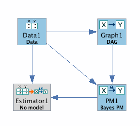
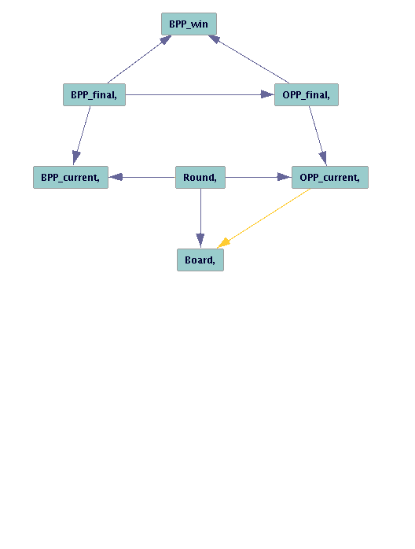

# Workflow for Learning Netowrk's Parameters with Tetrad and use them with pomegranate

## Tetrad

1. Data1 Data: Select all 5 files in 2M-split directory using `File / Load Data`. Make sure to check 'discrete data', and delimiter: 'comma'
2. Graph1: Choose Dag in Pattern, construct the graph as shown below
3. PM1: Choose Bayes Parametric Model, and fix missing discrete values. Right click on the box to enable logging.
4. Estimator1: Enable logging for that box. Run an ML Bayes estimator.

## From Excel to Pandas to CSV

1. Save output of Tetrad to an excel file, where each node has its own sheet. `results.xlsx`
2. Make sure to add the discrete classes for that node in the top row, and fix the order of the parent classes in their respective columns. `results-clean.xlsx`
3. Use `xls-csv.py` to process the resulting file into the format expected by tetrad. This will output 1 CSV file per node into a folder named Pome. `Pome/Node_name.csv`

## From CSV to Pomegranate

You can finally use `bayesian-net.py` to read the resulting CSV files and turn them into a network using pomegranate. This file will expose an API for performing inference on that network without having to reload each time.
